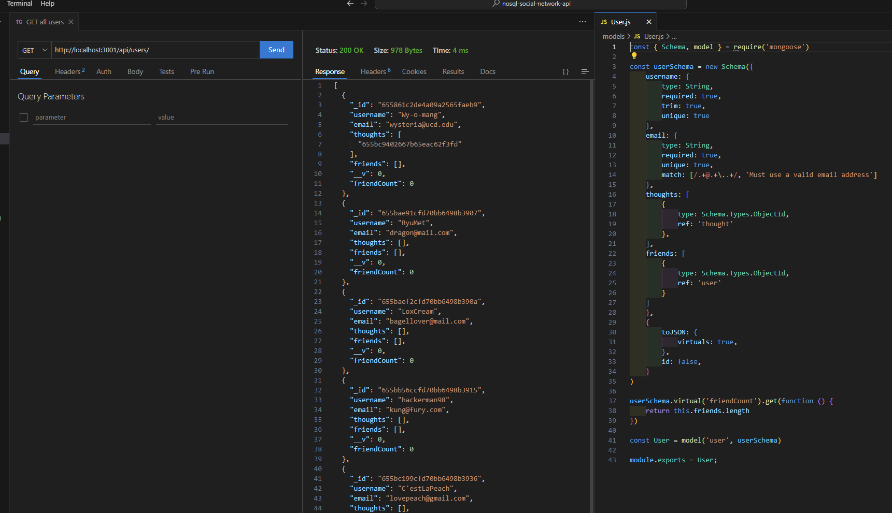

# Module Eighteen Challenge: NoSQL Social Network API

## Description
Express routes using Mongoose as ODM to communicate with a mongoDB NoSQL database.

## Acceptance Criteria

```md
GIVEN a social network API:

WHEN I enter the command to invoke the application
THEN my server is started and the Mongoose models are synced to the MongoDB database

WHEN I open API GET routes in Insomnia for users and thoughts
THEN the data for each of these routes is displayed in a formatted JSON

WHEN I test API POST, PUT, and DELETE routes in Insomnia
THEN I am able to successfully create, update, and delete users and thoughts in my database

WHEN I test API POST and DELETE routes in Insomnia
THEN I am able to successfully create and delete reactions to thoughts and add and remove friends to a user’s friend list
```

## Mock-Up

The following is a link to a video walkthrough of the code and route testing:

https://youtu.be/jwVC_1wwAn8

Screenshot of user route testing and the user model:



## Installation

1. `npm i` or `npm install` to download dependencies.
2. `node index.js` or `npm start` (npm script) to start server.

## Credits
Mongoose Documentation:

https://mongoosejs.com/docs/guide.html

Phind for debugging:

https://www.phind.com/